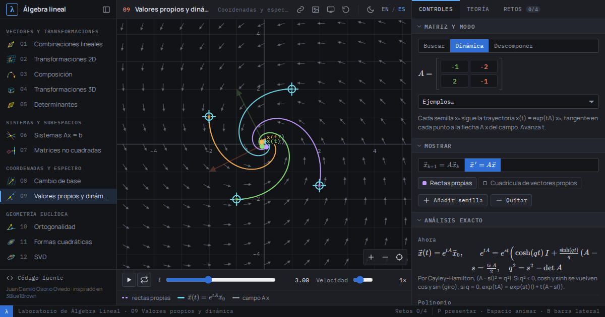

# Laboratorio Interactivo de Álgebra Lineal

**[osvo.com.co/algebra-lineal](https://osvo.com.co/algebra-lineal/)** · [English below](#linear-algebra-laboratory)



Catorce laboratorios interactivos para desarrollar intuición geométrica sobre el álgebra lineal: arrastra vectores, escribe matrices exactas y observa cómo responde el espacio. Cada módulo combina una visualización, un análisis **exacto** (fracciones y radicales, no decimales redondeados), explicaciones por capas y retos con verificación automática. Está disponible en español e inglés.

## Módulos

| # | Módulo | Qué se explora |
|---|--------|----------------|
| 01 | Combinaciones lineales | Generado, independencia lineal, bases y dimensión en ℝ² y ℝ³; ecuaciones implícitas exactas del generado y relaciones de dependencia. |
| 02 | Transformaciones 2D | Una matriz 2 × 2 como movimiento del plano: determinante, vectores propios, núcleo, imagen, inversa, círculo unitario. |
| 03 | Composición | Producto de matrices como composición; no conmutatividad; `det(BA) = det B · det A`; `(BA)⁻¹ = A⁻¹B⁻¹`. |
| 04 | Transformaciones 3D | Rotaciones (Rodrigues), proyecciones, reflexiones de Householder, cizallas; volumen, ejes y planos invariantes. |
| 05 | Determinantes | Área y volumen con signo; efecto animado de escalar, intercambiar y cizallar columnas; regla de Cramer geométrica; desarrollo por cofactores y por eliminación. |
| 06 | Sistemas Ax = b | Imagen de filas y de columnas; eliminación gaussiana paso a paso o manual, matrices elementales, Rouché–Frobenius; inversa con `[A \| I]` y factorización `PA = LU`. |
| 07 | Matrices no cuadradas | Transformaciones ℝⁿ → ℝᵐ con vistas de dominio y codominio; los cuatro subespacios fundamentales y su ortogonalidad; teorema del rango. |
| 08 | Cambio de base | Coordenadas de un vector en dos bases (en ambos sentidos) y matrices semejantes `P⁻¹AP`. |
| 09 | Valores propios y dinámica | Búsqueda visual de direcciones propias, órbitas de `xₖ₊₁ = A xₖ`, flujos `x′ = Ax` con `e^{tA}` y plano traza–determinante, diagonalización, formas de rotación-escalado y de Jordan. |
| 10 | Ortogonalidad | Producto punto y proyecciones, Gram–Schmidt en 3D (factorización QR), mínimos cuadrados como proyección sobre el espacio columna. |
| 11 | Formas cuadráticas | Cónicas como curvas de nivel de `xᵀAx`, teorema espectral, ejes principales, criterio de Sylvester y cociente de Rayleigh. |
| 12 | Descomposición en valores singulares | El círculo unitario se vuelve una elipse; `A = UΣVᵀ` animado; número de condición; aproximación de rango 1. |
| 13 | Espacios de polinomios | 𝒫ₙ como espacio vectorial: coordenadas en bases de monomios, Taylor, Lagrange y Legendre; derivada y traslación como matrices; interpolación con Vandermonde. |
| 14 | Transformaciones no lineales | Fórmulas propias, prueba de linealidad y la jacobiana como aproximación lineal local. |

## Funcionalidades

- **Cálculo exacto.** Las celdas aceptan expresiones como `1/3`, `-√2/2`, `cos(pi/6)`, `2^-1` o `0,5`. Si las entradas son racionales, el determinante, la inversa, la forma escalonada reducida, el núcleo, la imagen, las proyecciones y los valores y vectores propios se calculan en ℚ o en ℚ(√m). Así aparecen, por ejemplo, λ = (1 ± √5)/2 o i. Solo se usa aritmética de punto flotante cuando no hay forma cerrada sencilla.
- **Explicaciones por capas.** Cada módulo incluye «Qué estás viendo», una lista de experimentos guiados y una pestaña «Formalmente» con definiciones y teoremas enunciados con precisión (KaTeX).
- **58 retos** con verificación automática y pistas. El progreso se guarda en el navegador.
- **Enlaces compartibles.** Toda la configuración (matrices, vectores, modo, paso de la animación) vive en la URL.
- **Modo presentación** (tecla `P`) para proyectar, **tema claro/oscuro** y **exportación a PNG**.
- **Accesible y adaptable.** Funciona en móvil (arrastre y pellizco). En los lienzos 2D los puntos también se mueven con el teclado (`[`/`]` para elegir, flechas para mover, `+`/`−` para acercar), y todo valor que se arrastra también se puede escribir en una celda etiquetada.
- **Sin conexión.** Es una PWA instalable y, tras la primera visita, funciona sin internet. No depende de ningún CDN.

## Uso local

El sitio es estático y no necesita compilación, pero usa módulos ES, que los navegadores no cargan desde `file://`. Sirve la carpeta con cualquier servidor:

```bash
git clone https://github.com/osvo/algebra-lineal.git
cd algebra-lineal
python3 -m http.server 8080      # o: npx serve .
# abre http://localhost:8080
```

## Estructura

```
index.html, *.html            páginas (carcasas generadas por tools/build-pages.mjs)
assets/css/lab.css            sistema de diseño (temas oscuro y claro)
assets/js/core/               matemática pura: racionales (BigInt), ℚ(√m), parser, álgebra lineal
                              genérica sobre cuerpos (RREF, LU, e^{tA}), valores propios exactos, SVD,
                              espacios de polinomios, formato
assets/js/ui/                 i18n, estado con URL, carcasa de página, controles, lienzos 2D y 3D
assets/js/modules/            un archivo por módulo (lógica, textos ES/EN, retos) y el registro
vendor/                       KaTeX, three.js (subconjunto) y fuentes, servidos localmente
tests/                        pruebas unitarias (node --test) y de navegador (Playwright)
tools/                        generador de páginas y del service worker; actualización de vendor/
```

## Desarrollo

```bash
node --test tests/*.test.mjs   # pruebas del núcleo matemático
node tests/e2e.mjs             # pruebas de navegador (requiere Playwright y Chromium)
node tools/build-pages.mjs     # regenera las páginas HTML y sw.js tras cambiar el registro o los archivos
sh tools/vendor.sh             # actualiza KaTeX, three.js y las fuentes de vendor/
```

Para añadir un módulo: regístralo en `assets/js/modules/registry.js`, crea `assets/js/modules/<id>.js` con `createLab({...})` y ejecuta `node tools/build-pages.mjs`.

## Influencia y reconocimiento

Proyecto independiente de Juan Camilo Osorio Oviedo, fuertemente inspirado en el enfoque de matemáticas visuales de [3Blue1Brown](https://www.3blue1brown.com/). No está afiliado oficialmente con 3Blue1Brown.

Usa [KaTeX](https://katex.org) (MIT), [three.js](https://threejs.org) (MIT) y las fuentes Manrope e IBM Plex Mono (SIL Open Font License).

---

# Linear Algebra Laboratory

**[osvo.com.co/algebra-lineal](https://osvo.com.co/algebra-lineal/?lang=en)**

Fourteen interactive labs for building geometric intuition about linear algebra: drag vectors, type exact matrices and watch space respond. Each module combines a visualization, an **exact** analysis (fractions and radicals, not rounded decimals), layered explanations and automatically checked challenges. Available in English and Spanish.

## Modules

| # | Module | What you explore |
|---|--------|------------------|
| 01 | Linear combinations | Span, linear independence, bases and dimension in ℝ² and ℝ³; exact implicit equations of the span and dependency relations. |
| 02 | 2D transformations | A 2 × 2 matrix as a motion of the plane: determinant, eigenvectors, kernel, image, inverse, unit circle. |
| 03 | Composition | Matrix product as composition; non-commutativity; `det(BA) = det B · det A`; `(BA)⁻¹ = A⁻¹B⁻¹`. |
| 04 | 3D transformations | Rotations (Rodrigues), projections, Householder reflections, shears; volume, invariant axes and planes. |
| 05 | Determinants | Signed area and volume; animated effect of scaling, swapping and shearing columns; geometric Cramer's rule; cofactor expansion and elimination. |
| 06 | Systems Ax = b | Row and column pictures; step-by-step or manual Gaussian elimination, elementary matrices, Rouché–Capelli; inverse via `[A \| I]` and `PA = LU`. |
| 07 | Non-square matrices | Maps ℝⁿ → ℝᵐ with domain and codomain views; the four fundamental subspaces and their orthogonality; rank–nullity. |
| 08 | Change of basis | Coordinates of a vector in two bases (both directions) and similar matrices `P⁻¹AP`. |
| 09 | Eigenvalues and dynamics | Visual search for eigen-directions, orbits of `xₖ₊₁ = A xₖ`, flows `x′ = Ax` with `e^{tA}` and the trace–determinant plane, diagonalization, rotation-scaling and Jordan forms. |
| 10 | Orthogonality | Dot product and projections, Gram–Schmidt in 3D (QR factorization), least squares as projection onto the column space. |
| 11 | Quadratic forms | Conics as level curves of `xᵀAx`, spectral theorem, principal axes, Sylvester's criterion and the Rayleigh quotient. |
| 12 | Singular value decomposition | The unit circle becomes an ellipse; animated `A = UΣVᵀ`; condition number; rank-1 approximation. |
| 13 | Polynomial spaces | 𝒫ₙ as a vector space: coordinates in monomial, Taylor, Lagrange and Legendre bases; derivative and shift as matrices; interpolation with Vandermonde. |
| 14 | Nonlinear transformations | Custom formulas, linearity test and the Jacobian as a local linear approximation. |

## Features

- **Exact computation.** Cells accept expressions like `1/3`, `-√2/2`, `cos(pi/6)` or `2^-1`. With rational entries, determinants, inverses, reduced echelon forms, kernels, images, projections, eigenvalues and eigenvectors are computed in ℚ or ℚ(√m). This gives, for example, λ = (1 ± √5)/2 or i. Floating point is used only when there is no simple closed form.
- **Layered explanations**: “What you are seeing”, guided experiments and a “Formally” tab with precise definitions and theorems.
- **58 challenges** with automatic checking and hints; progress is saved in the browser.
- **Shareable links**: the whole configuration lives in the URL.
- **Presentation mode** (`P` key), **light/dark theme** and **PNG export**.
- **Accessible and responsive**: touch drag and pinch; on 2D canvases points can also be moved with the keyboard (`[`/`]` to select, arrows to move, `+`/`−` to zoom), and every draggable value can also be typed into a labelled cell.
- **Offline**: an installable PWA with no CDN dependencies.

## Running locally

The site is static and needs no build, but it uses ES modules, which browsers do not load from `file://`. Serve the folder with any web server, e.g. `python3 -m http.server 8080`, and open `http://localhost:8080`.

## Development

`node --test tests/*.test.mjs` runs the math core tests, `node tests/e2e.mjs` the browser tests (Playwright + Chromium), `node tools/build-pages.mjs` regenerates the HTML shells and the service worker, and `sh tools/vendor.sh` updates the vendored libraries.

## Credits

Independent project by Juan Camilo Osorio Oviedo, strongly inspired by the visual mathematics of [3Blue1Brown](https://www.3blue1brown.com/). It is not officially affiliated with 3Blue1Brown. Built with KaTeX (MIT), three.js (MIT), Manrope and IBM Plex Mono (SIL OFL).
